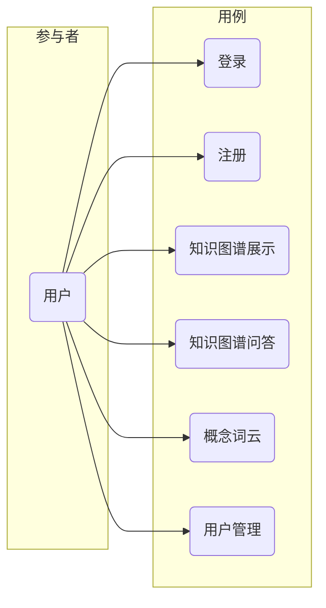
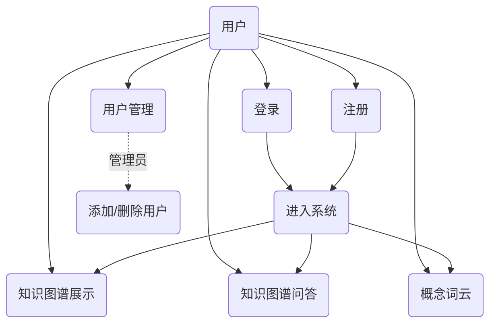
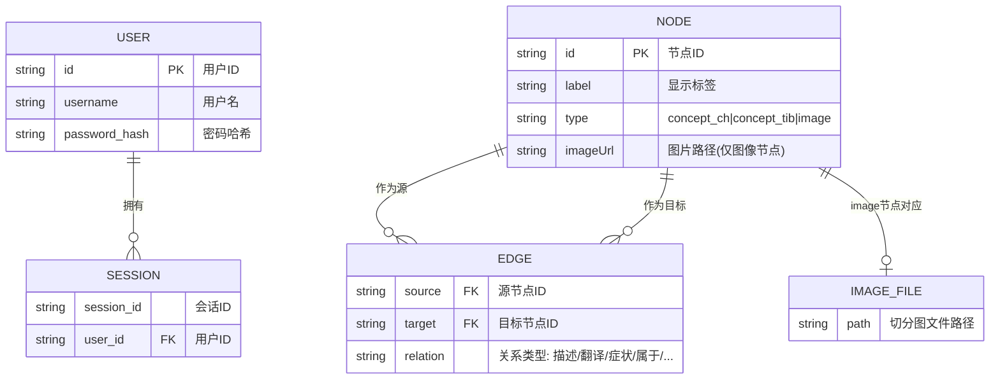
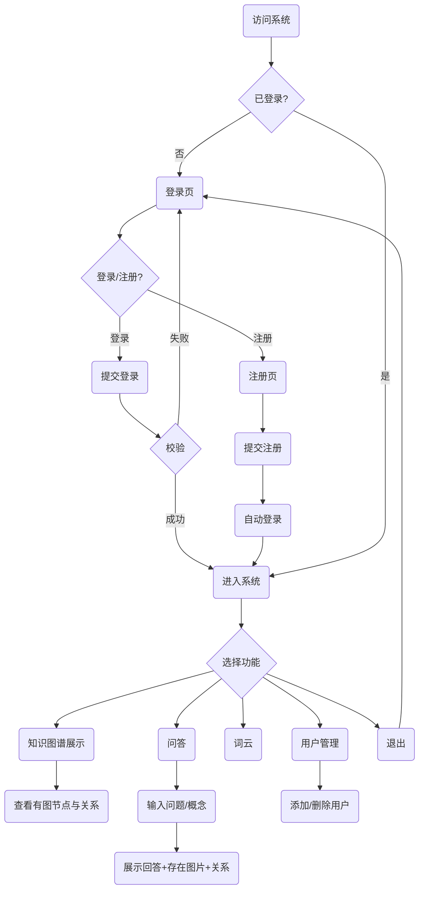
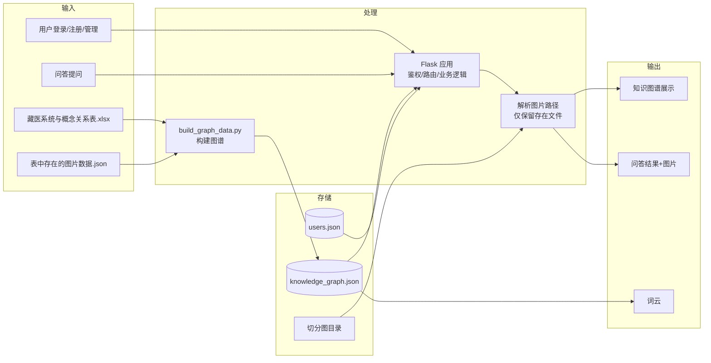
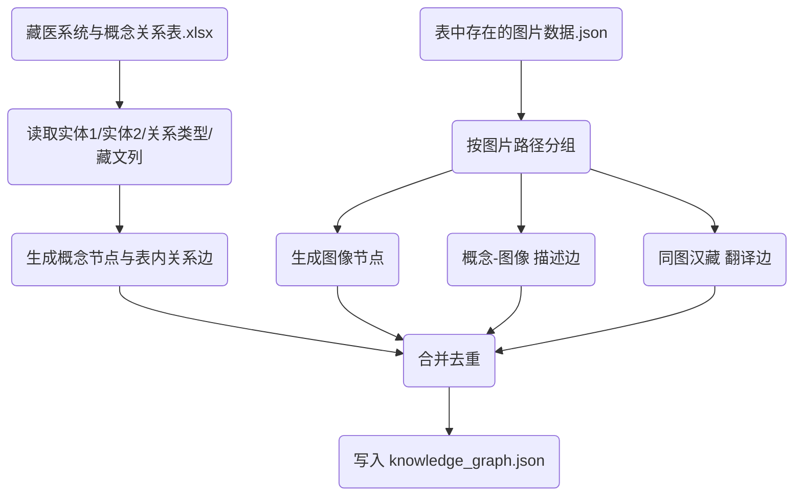

# 藏医多模态知识图谱系统 — 系统介绍

本文档从系统启动到各功能界面进行完整介绍，并包含 ER 图、用例图、系统架构图、业务流程图、数据流图等各类系统图。

---

## 一、系统概述

本系统是基于**藏医实体关系表**与**切分图数据**构建的多模态知识图谱应用，支持以图结构展示汉语/藏语概念与曼唐图像的关系，并提供问答、词云与用户管理功能。系统采用 B/S 架构，后端为 Python Flask，前端为 HTML/CSS/JavaScript，图谱与词云采用 ECharts 渲染。

**核心关系定义：**

- **描述**：概念（文字）与图像之间的对应关系，表示该图像是对该概念的图示说明。
- **翻译**：汉语概念与藏语概念之间的对应关系，来源于实体关系表中的汉藏实体列及同图下的汉藏概念对。
- **其他关系**：由《藏医系统与概念关系表》中的「关系类型」列定义（如属于、症状、病因等）。

**主要特性：**

- 进入系统需先登录；支持用户注册与用户管理（管理员可添加/删除用户）。
- 知识图谱展示与问答中的图片均只展示**真实存在**的切分图文件，不存在则不展示对应节点或图片卡片。
- 词云基于图谱中的概念词频生成；问答支持自然语言式提问（如「培根病有什么症状」「隆病问诊枝有什么内容」）。

---

## 二、系统启动与运行

### 2.1 环境要求

- Python 3.7+
- 依赖：`flask`、`flask-login`、`pandas`、`openpyxl`（见 `requirements.txt`）

### 2.2 启动步骤

```bash
# 1. 进入项目目录
cd e:\xitong

# 2. 安装依赖
pip install -r requirements.txt

# 3. （可选）若切分图在其他路径，设置环境变量
# set CUT_IMAGE_ROOT=D:\藏医切分图

# 4. 启动服务
python app.py
```

服务默认在 **http://127.0.0.1:5000** 启动。浏览器访问该地址会跳转到**登录页**，登录成功后进入系统。

### 2.3 默认账号

- 首次运行会自动创建默认管理员：**用户名 `admin`，密码 `admin123`**。
- 用户数据持久化在 `data/users.json`。

### 2.4 数据与图谱更新

- 图谱数据来自 `data/knowledge_graph.json`，由脚本根据 Excel 与图片映射表生成。
- 若更新了《藏医系统与概念关系表》或《表中存在的图片数据》，需重新生成图谱：

```bash
cd data
python build_graph_data.py
```

---

## 三、各界面介绍

### 3.1 登录界面（/login）

**功能说明：**  
未登录用户访问系统任意页面时会被重定向到登录页。用户输入用户名和密码，校验通过后进入系统（默认跳转到知识图谱页），并保持登录态。

**界面要素：**

- 标题：「登录」
- 输入项：用户名、密码
- 按钮：「登录」
- 提示：默认管理员账号说明；「没有账号？去注册」链接

**使用方式：** 输入已注册的用户名与密码，点击「登录」。若需注册新账号，点击「去注册」进入注册页。

---

### 3.2 注册界面（/register）

**功能说明：**  
新用户可在此完成账号注册。填写用户名、密码、确认密码并提交后，系统会校验用户名是否已存在及两次密码是否一致；通过后自动登录并跳转到首页（知识图谱）。

**界面要素：**

- 标题：「用户注册」
- 输入项：用户名、密码、确认密码
- 按钮：「注册」
- 链接：「已有账号？去登录」

**使用方式：** 填写信息后点击「注册」。注册成功后无需再次登录即可使用系统。

---

### 3.3 知识图谱展示（/graph）

**功能说明：**  
以力导向图形式展示藏医多模态知识图谱。**仅展示有配图的部分**：即「图像节点」（其对应切分图文件在服务器上存在）以及与这些图像存在「描述」关系的概念节点；边仅保留上述节点之间的关连。

**界面要素：**

- 顶部导航：知识图谱、问答、词云、用户管理、退出
- 标题：「知识图谱展示」
- 说明：「仅展示有配图的概念与图像节点。」
- 主区域：ECharts 力导向图，节点可拖拽、缩放、平移
- 图例：汉语概念（绿）、藏语概念（浅蓝）、图像（紫）；边类型：描述（概念-图像）、翻译（汉-藏）、其他关系

**节点与边：**

- **汉语概念**：来自实体关系表或图片映射的汉语概念名。
- **藏语概念**：来自实体关系表或同图汉藏对的藏语概念名。
- **图像节点**：对应切分图文件；若文件存在则显示缩略图，悬停可看大图；若不存在则该节点不会出现在图中（后端已过滤）。

**使用方式：** 登录后默认进入本页；通过导航栏可随时返回。在图上游走、缩放即可浏览概念与图像关系。

---

### 3.4 知识图谱问答（/qa）

**功能说明：**  
用户输入问题或概念名，系统基于知识图谱检索相关关系与**真实存在的**配图，并以「回答 + 相关图像 + 相关知识关系」的形式展示。仅当切分图文件存在时，才会在「相关图像」和关系列表中出现该图。

**界面要素：**

- 说明：「以下推荐问题均有配图，可直接点击提问。」
- **推荐问题**（可点击）：如「培根病丸剂枝是什么」「隆病问诊枝有什么内容」「维命隆叶」「赤巴病泻下枝」等，均为有配图的概念。
- 输入框与「提问」按钮
- 结果区：
  - **回答**：自然语言总结（如「X 的症状包括：…」或「与 X 相关的知识共 N 条关系」及部分关系列表）。
  - **相关图像**：仅展示图片文件存在的条目，每张图下显示对应概念标签。
  - **相关知识关系**：列表形式展示「源概念 — 关系 — 目标概念」；仅当某关系的目标/源为图像且文件存在时，该行才显示小图，否则不显示图片。

**问答逻辑简述：**

- 支持问法：如「X 有什么症状」「X 怎么治」「X 是什么」等，系统会抽取概念 X 并检索图谱中与 X 相关的边。
- 「症状」类问题会优先整理并展示关系类型为「症状」的条目；治疗类问题会列出与治疗、药物等相关的关系。
- 所有返回的图片均经过存在性校验，不存在的不会展示（不出现「暂无图片」卡片）。

---

### 3.5 概念词云（/wordcloud）

**功能说明：**  
根据知识图谱中所有概念（不含图像节点）的出现频次生成词云，词频越高字体越大，用于直观查看概念分布。

**界面要素：**

- 标题：「概念词云」
- 主区域：ECharts 词云图（基于 echarts-wordcloud 扩展）
- 说明：「展示知识图谱中概念出现的频次，字体越大表示出现越多。」

**使用方式：** 登录后通过导航栏进入「词云」即可查看，无需输入。

---

### 3.6 用户管理（/users）

**功能说明：**  
仅登录用户可访问。管理员可查看用户列表、添加新用户、删除其他用户（不能删除当前登录用户）。用户数据保存在 `data/users.json`。

**界面要素：**

- 标题：「用户管理」
- 按钮：「添加用户」
- 表格：用户名、操作（删除按钮，当前用户无删除按钮）
- 弹窗：添加用户时输入用户名、密码

**使用方式：** 点击「添加用户」填写用户名与密码完成添加；在列表中对其他用户点击「删除」可移除该用户（需确认）。

---

## 四、系统图

**Draw.io 源文件：** 所有下图已整理为 draw.io 多页文件，可直接用 [draw.io](https://app.diagrams.net/)（或 VS Code 插件 Draw.io Integration）打开编辑：`docs/系统图_drawio.drawio`。文件内包含 7 个页面：系统架构图、用例图、ER 图、业务流程图、数据流图、页面结构图、图谱构建流程。

### 4.1 系统架构图

```mermaid
flowchart TB
    subgraph 用户端
        Browser[浏览器]
    end
    subgraph Web应用
        Flask[Flask 应用]
        Auth[登录/注册/鉴权]
        GraphAPI[/api/graph]
        QAAPI[/api/qa]
        WCAPI[/api/wordcloud]
        UserAPI[/api/users]
        ImgRoute[/切分图/...]
    end
    subgraph 数据与存储
        KG[(knowledge_graph.json)]
        Users[(users.json)]
        Excel[(藏医系统与概念关系表.xlsx)]
        ImgData[(表中存在的图片数据.json)]
        CutImg[切分图目录]
    end
    Browser --> Flask
    Flask --> Auth
    Flask --> GraphAPI
    Flask --> QAAPI
    Flask --> WCAPI
    Flask --> UserAPI
    Flask --> ImgRoute
    GraphAPI --> KG
    GraphAPI --> CutImg
    QAAPI --> KG
    QAAPI --> CutImg
    WCAPI --> KG
    UserAPI --> Users
    Auth --> Users
    ImgRoute --> CutImg
```

---

### 4.2 用例图





---

### 4.3 ER 图（实体关系图）



**说明：**

- **USER**：系统用户，对应 `users.json`。
- **NODE**：图谱节点，类型为汉语概念（concept_ch）、藏语概念（concept_tib）或图像（image）；图像节点带 `imageUrl`。
- **EDGE**：图谱边，关系类型包括「描述」「翻译」及 Excel 中的关系类型。
- **IMAGE_FILE**：磁盘上的切分图文件；展示与问答中仅展示能解析到真实文件的节点/图片。

---

### 4.4 业务流程图（用户使用流程）



---

### 4.5 数据流图（DFD 简图）



---

### 4.6 页面/模块结构图

```mermaid
flowchart TB
    Root(/) --> Login(登录 /login)
    Root --> Register(注册 /register)
    Root --> Index(首页 重定向)
    Index --> Graph(知识图谱 /graph)
    Nav(导航栏) --> Graph
    Nav --> QA(问答 /qa)
    Nav --> WordCloud(词云 /wordcloud)
    Nav --> Users(用户管理 /users)
    Nav --> Logout(退出 /logout)
    Graph --> API_Graph[/api/graph]
    QA --> API_QA[/api/qa]
    WordCloud --> API_WC[/api/wordcloud]
    Users --> API_Users[/api/users]
    Img(图片请求) --> ImgRoute[/切分图/...]
```

---

### 4.7 图谱数据构建流程



---

## 五、目录与文件说明

| 路径 | 说明 |
|------|------|
| `app.py` | Flask 应用入口：路由、鉴权、图谱/问答/词云/用户 API、图片服务与存在性过滤 |
| `requirements.txt` | Python 依赖 |
| `data/藏医系统与概念关系表.xlsx` | 实体关系表（实体1、实体2、关系类型、藏文实体等） |
| `data/表中存在的图片数据.json` | 概念与图片路径对应表（由 match_table_images.py 生成） |
| `data/knowledge_graph.json` | 图谱节点与边（由 build_graph_data.py 生成） |
| `data/build_graph_data.py` | 构建图谱脚本 |
| `data/users.json` | 用户持久化存储 |
| `切分图/` 或 `data/切分图/` | 切分图根目录；可含子目录 1juan2juan、3-5-6juan |
| `templates/*.html` | 各页面模板（登录、注册、图谱、问答、词云、用户管理、base） |
| `static/*` | 静态资源（样式、脚本） |
| `docs/系统介绍.md` | 本文档 |

---

## 六、总结

- **系统启动**：安装依赖后执行 `python app.py`，浏览器访问 http://127.0.0.1:5000，经登录或注册后使用。
- **各界面**：登录、注册、知识图谱展示、知识图谱问答、概念词云、用户管理，均已按「只展示存在图片」的策略做了过滤。
- **系统图**：涵盖系统架构、用例、ER 图、业务流程图、数据流图、页面结构及图谱构建流程，便于理解与维护。

如需扩展功能或调整数据来源，可优先修改 `app.py` 中的 API 与过滤逻辑，以及 `data/build_graph_data.py` 中的图谱构建规则。
